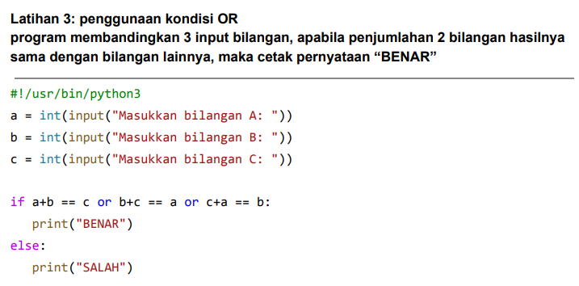
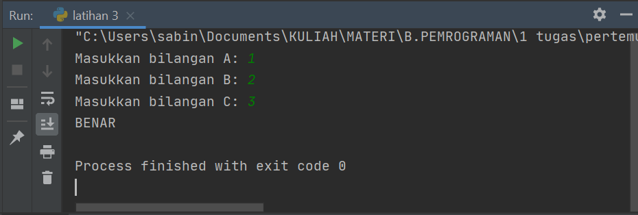
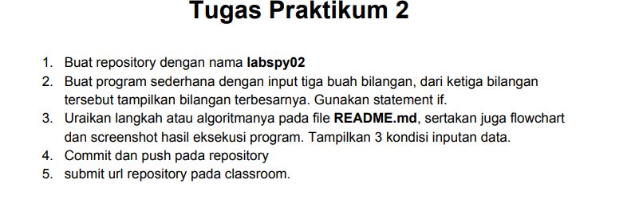
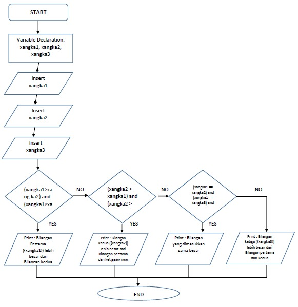
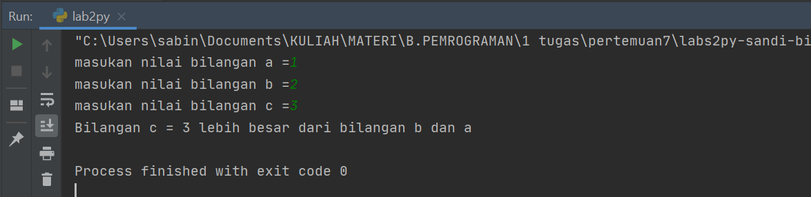
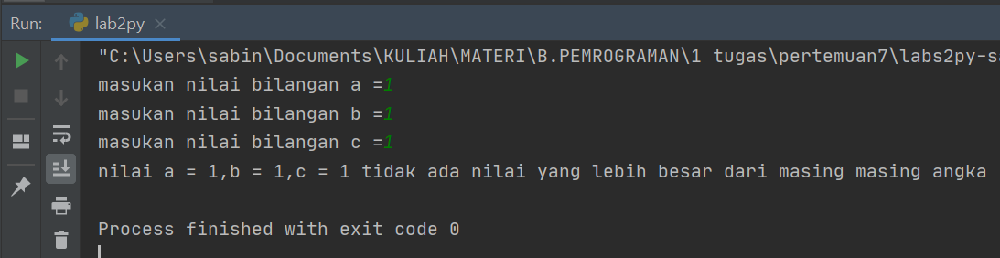

# labs2py
Mata Kuliah : Bahasa Pemrograman<br>
Dosen       : Agung Nugroho, S.kom, M.kom<br>
<br>
Nama        : Sandi Bintara<br>
NIM         : 312010039<br>
Kelas       : TI 20 B1<br>

Tugas Pertemuan 7 (Labspy2)<br>

# List Tugas
1. Latihan 3 [click here](#1-latihan-3)
2. Praktikum 2 [cick here](#2-praktikum-2-labspy2)
---

# 1. Latihan 3


Penulisannya seperti berikut :
```python
#!/usr/bin/python3
a = int(input("Masukkan bilangan A: "))
b = int(input("Masukkan bilangan B: "))
c = int(input("Masukkan bilangan C: "))
if a+b == c or b+c == a or c+a == b:
 print("BENAR")
else:
 print("SALAH")
```
* Hasil running time

  >Hasilnya menyatakan Benar jika bilangan berisi angka berurutan atau berkelipatan

# 2. Praktikum (2 labspy2)
<br><br>

`soal :`
<br>

<br><br>

* Penulisan flowchart sebagai berikut dengan contoh indexs xangka1 = a dan seterusnya :
<br>

<br><br>

 * Penulisan dengan code python :
<br>
```python
# labs2py
a = int(input("masukan nilai bilangan a ="))
b = int(input("masukan nilai bilangan b ="))
c = int(input("masukan nilai bilangan c ="))

if (a>b) and (a>c):
    print(f"Bilangan a = {a} lebih besar dari bilangan b dan c")
elif (b>a) and (b>c):
    print(f"Bilangan b = {b} lebih besar dari bilangan a dan c")
elif (c>b) and (c>a):
    print(f"Bilangan c = {c} lebih besar dari bilangan b dan a")
else :
    print(f"nilai a = {a},b = {b},c = {c} tidak ada nilai yang lebih besar dari masing masing angka")
```
<br><br>

>Hasil eksekusi untuk input bilangan a=1, b=2, c=3 yang hasilnya c adalah bilangan terbesar dari inputan data tersebut :


<br>

>hasil eksekusi untuk input bilangan a=1, b=1, c=1 yang hasilnya tidak ada bilangan yang besar dari masing-masing angka  :


<br><br>

Terima Kasih sekian...